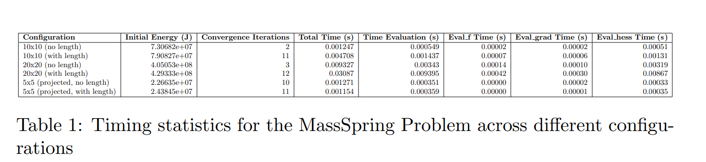

 

# Newton’s Method - README

### Participants and Their Investment (Up to the Assistant to Assess):
- Ahonon Gobi : Full contribution to both theory and coding (100%).
- Deep Shukla : Significant contributions to both theory and coding (80%).
- Jules Odjé : Contributions on theory, minimal coding contributions (30%).

### Programming (7 pts)

The goal was to implement the following:

1. **Standard Newton Method**  
2. **Newton Method with Modified Hessian**  
3. **Newton Methods vs Gradient Descent**  
4. **Bonus: Exploiting Partial Separability**

### 1. **Standard Newton Method (3 pts)**

In this part, the task was to implement the standard Newton's method. The function `solve(...)` in the `NewtonMethods.hh` file needed to be completed to solve the optimization problem.

#### How We Solved It:
- The **Newton direction** $( \Delta x_{\text{nt}} )$ was computed by attempting to solve the system using the **inverse of the Hessian matrix**. However, directly computing the inverse is inefficient, so we used **Cholesky factorization** to decompose the Hessian matrix and solve the resulting system efficiently.
- We utilized the **LDLT** module of the Eigen library to perform the Cholesky decomposition and solve the linear system for $( \Delta x_{\text{nt}} )$.
- The function `backtracking_line_search()` from the `LineSearch.hh` file was used to ensure proper convergence of the method.

### 2. **Newton Method with Modified Hessian (3 pts)**

The next task was to handle problems where the Hessian matrix may not be positive definite. In this case, we needed to modify the Hessian matrix by adding a constant to the diagonal entries until it becomes positive definite.

#### How We Solved It:
- We implemented the function `solve_with_projected_hessian(...)` in the `NewtonMethods.hh` file to modify the Hessian matrix.
- **Cholesky decomposition** was used, and if it failed (i.e., the matrix was not positive definite), we iterated by adding a constant $( \delta )$ to the diagonal of the Hessian matrix.
- We started with an initial value of $( \delta_0 )$ based on the formula:
  $[
  \delta_0 = \frac{10^{-3} \cdot |\text{trace}(H)|}{n}
  ]$
  where $( n )$ is the number of variables, and the constant $( \delta )$ was increased by a factor of $( \gamma )$ with $( \gamma > 1 )$.
- This ensured that the modified Hessian matrix was positive definite, allowing us to solve the system for $( \Delta x_{\text{nt}} )$ efficiently.

- However, finding the exact delta was tricky, and I found that the value must be around $( 1 \times 10^{-1} )$ in order to pass the test.

### 3. **Newton Methods vs Gradient Descent (1 pt)**

This task required comparing the performance of Newton's method with that of gradient descent on the MassSpringProblem. We experimented with different spring graph dimensions (5x5, 10x10, and 20x20) and compared the results in terms of convergence and performance.

#### How We Solved It:
- We used both the standard **Newton's method** and **gradient descent** to solve the MassSpringProblem for the specified dimensions of the SpringElement2D and SpringElement2DWithLength.
- We recorded the **timing statistics** for both methods and saved the results in text files for comparison.

### 4. **Bonus: Exploiting Partial Separability (3 pts)**

The bonus part involved exploiting the **partial separability** of the problem to modify local Hessians instead of using the global Hessian. This modification was particularly useful for the SpringElement2DWithLength problem.

#### How We Solved It:
- We implemented the `eval_hessian(...)` function in the `SpringElement2DWithLengthPSDHess.hh` file, which handled the modification of the local Hessians to make them positive definite.
- The local Hessians were projected onto positive definite matrices, which allowed the standard Newton method to be applied to solve the MassSpringProblem efficiently.
- We tested this implementation by running the `NewtonMethod` executable and confirming that the results were correct for the modified Hessians.

### Tests

